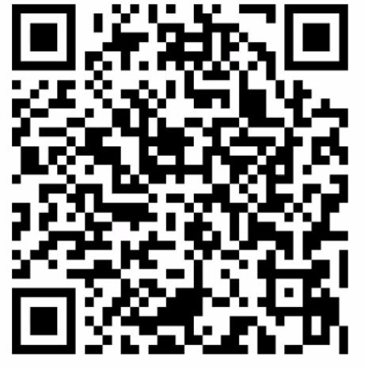

>

| 제목    | 내용    | 설명    |
| ------- | ------- | ------- |
| 테스트1 | 테스트2 | 테스트3 |
| 테스트1 | 테스트2 | 테스트3 |
| 테스트1 | 테스트2 | 테스트3 |


[구글 링크](https://google.com)에서 검색을 잘하자!

[멀캠 zoom 접속링크](https://us02web.zoom.us/j/84936807022?pwd=ZUwwbkU0Vnh5YUZvZTFINVdwck51dz09)

[멀캠 출첵 QR코드]()

~~취소선~~

**굵게(볼드)**

*기울임(이탤릭)*

---

--- 수평선

## 기타

### 기타

#### 기타

##### 기타

# 기타

1. 

   1. 탭과 스페이스

      

* *순서없음
  * 순서없음
    * 순서없음


* 순서없음


```javascript
const a = 1;
var b = 3;
```

```java
ArrayList<Integer> list = new ArrayList<Integer>();
```


